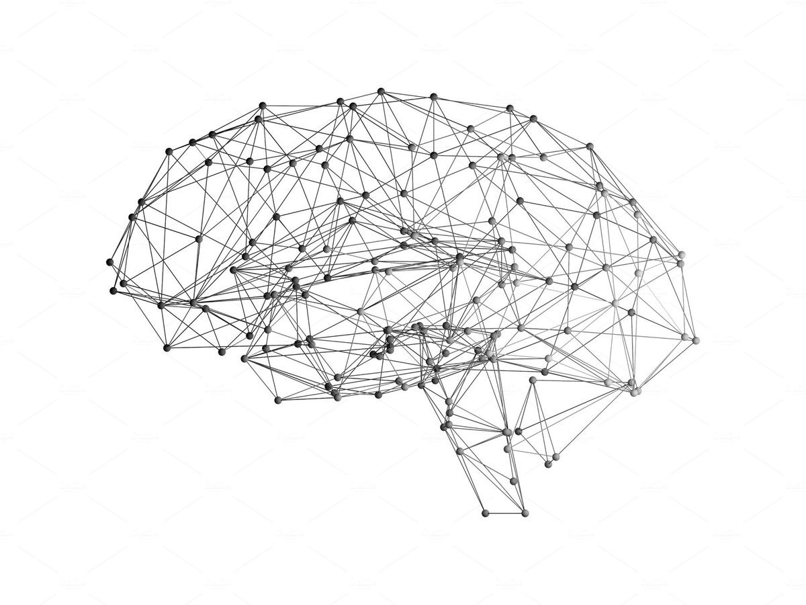

**Project Identity & Researcher Verification**

#### [**ORCID**](https://orcid.org/0009-0002-2605-7729) **iD**

---

**Author:** Davide Luca Nicoletti

**First Public Release:** 2026

**Complex Systems Modeling**

---

## Research 

**EEG · fMRI · fNIRS  
Telemetry · Adaptive Systems**

---

### Neural Topology

**How to Access the Technical Abstract**

The core theoretical and operational principles of the **Neurodynamical Regime Intelligence (NRI)** framework are detailed in a dedicated document. This ensures the technical specificities remain distinct from the implementation details.

To read the universal omeostatic anchor principles, the predictive lead-time metrics, and the cross-dataset validation results, please navigate to the following file:

👉 **[View Abstract: abstract.md](abstract.md)**

